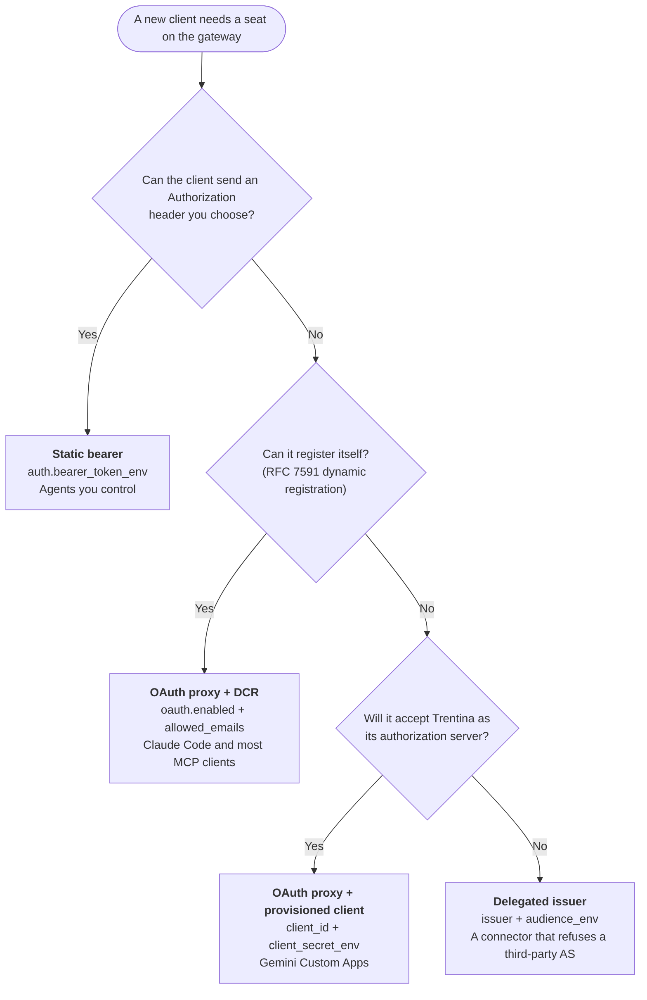
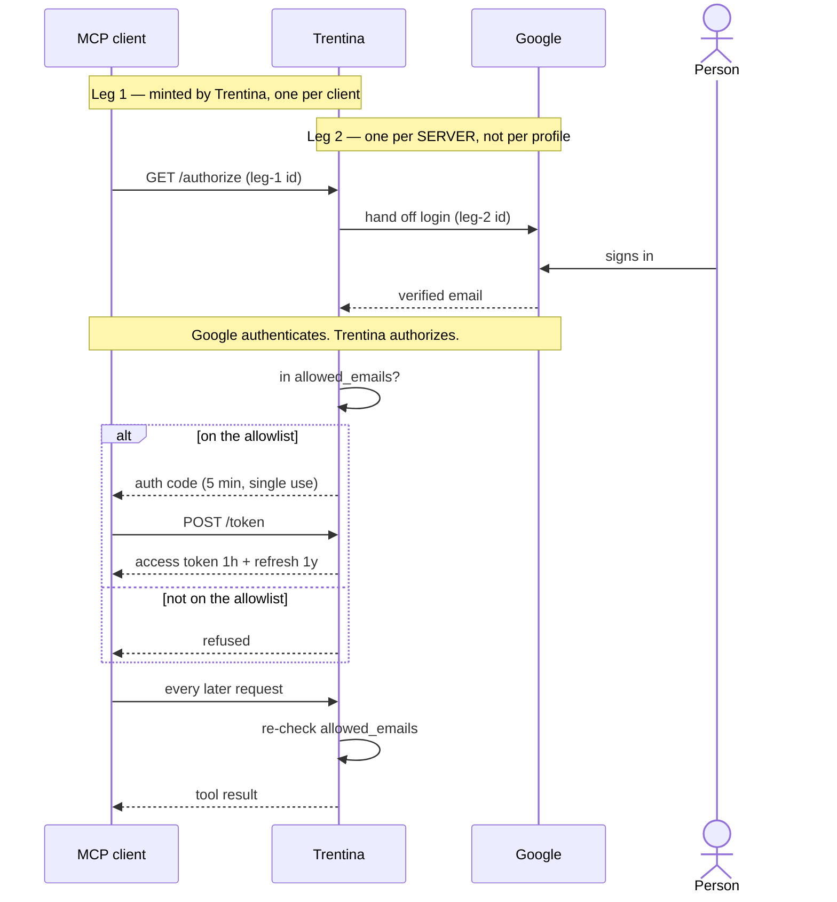
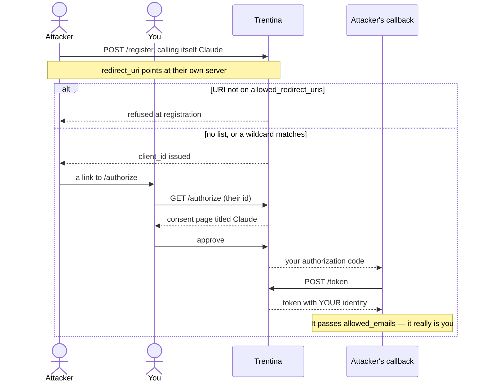
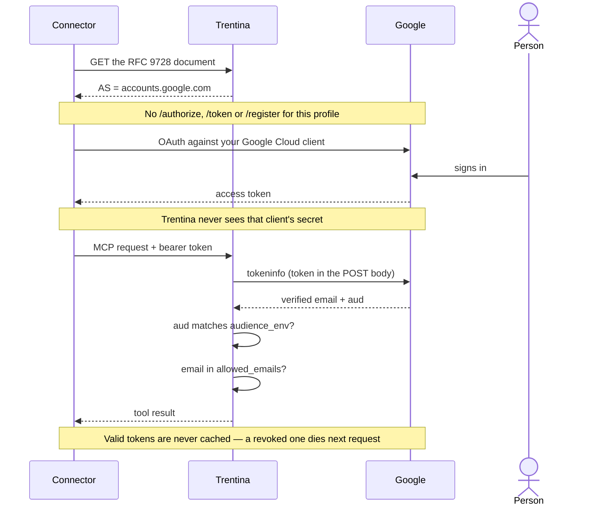

# Authentication

Trentina supports four ways for a client to prove who it is. They are not
alternatives to pick once for the gateway — each is set per profile, so one
gateway can serve an agent over a static token, a desktop MCP client over
dynamic registration, and a vendor connector over an external identity
provider, all at the same time.

Authentication answers "who is this". Authorization — "may they use this
profile" — is always `allowed_emails` in the OAuth modes, and possession of the
token in the static one.

## Choosing one

| Mechanism | Who mints the token | Client must support | Trentina's role | Use it for |
|---|---|---|---|---|
| **Static bearer** | You | Sending a header | Resource server with a shared secret | Agents you control — agent1, agent3, scripts |
| **OAuth proxy + DCR** | Trentina, proxying login to Google | Dynamic client registration | Authorization server **and** resource server | Claude Code and most MCP clients |
| **OAuth proxy + provisioned client** | Trentina | A pasted Client ID and Secret | Authorization server + resource server | A console-configured connector willing to use our AS |
| **Delegated issuer** | Google (or another IdP) directly | Linking to that IdP itself | Pure resource server | A connector that refuses a third-party AS. Not Gemini Custom Apps — see below |

Two quick tests. If the client can send an `Authorization` header you choose,
use a static bearer and stop. If it cannot, and it can register itself, use the
proxy — nothing to configure beyond the allowlist.


<!-- Editable source: https://lucid.app/lucidchart/5c2501c9-73f1-4ba5-b6f4-3eb74f8b86fa/edit -->

Whichever you pick, remember that the static bearer is checked first: a profile
carrying both mechanisms holds two independent credentials, and the one that
never expires wins.

## How proxy mode actually works

OAuth in this shape confuses almost everyone, because three different
credentials are in play and they all look alike. It helps to see that there are
two separate legs, each with its own credential, doing different jobs.

```
  Claude / Gemini  ───1───>  Trentina  ───2───>  Google
     the client              the server          the identity provider
```

**Leg 1 — the client proves itself to Trentina.** Trentina mints these
credentials. A client that supports dynamic registration asks for a pair and
gets one; a client that cannot, like gemini.google.com Custom Apps, has an
operator paste a pair declared in `profiles.yaml`. Either way there is one per
client, and this is the boundary that separates one seat from another.

**Leg 2 — Trentina proves itself to Google.** This is the Google Cloud OAuth
client (`TRENTINA_OAUTH_GOOGLE_CLIENT_ID` / `_CLIENT_SECRET`), and there is
exactly **one per server**, not one per profile. It identifies the gateway, so
Google knows which application is asking and what to name on the consent
screen. Every proxied profile shares it. A second one would only be a second
name for the same server; it would not separate two seats, because by the time
a login reaches this leg, which seat asked is no longer part of the question.

The full sequence for one login:

1. The client presents its leg-1 credential at `/authorize`.
2. Trentina hands the person to Google, presenting its leg-2 credential so
   Google knows who is asking.
3. The person signs in. Google returns the address it just verified.
4. Trentina checks that address against the profile's `allowed_emails` and
   decides whether to issue a token.



<!-- Editable source: https://lucid.app/lucidchart/e9bf44b3-8cb0-4ea6-bda0-31fb34da9f7a/edit -->

Step 4 is the one that matters. **Google does authentication; Trentina does
authorization.** Google has never heard of your allowlist and will vouch for
any Google account in the world — it is answering "who is this", not "should
they be here". The only thing standing between a stranger with a Google account
and your gateway is `allowed_emails`, which is why a profile with
`enabled: true` and an empty allowlist fails validation rather than starting.

It is also re-checked on **every request**, not once at login. Removing an
address cuts that person off at their next call, even though the token they
already hold is still cryptographically valid for up to another hour.

### Why this beats a static bearer

| | Static bearer | OAuth proxy |
|---|---|---|
| Lifetime | Forever, until you change it | Access token 1 hour, refreshed automatically |
| Identity | None — possession is the identity | A Google account, verified each request |
| Revoking one person | Rotate the token everywhere | Remove one line from `allowed_emails` |
| If it leaks | Full access until noticed | Useless within the hour |

The refresh token lasts a year by default and only rotates when Google rotates
its own; the authorization code in the middle of the flow is single-use and
lives five minutes.

One caveat that undoes all of it: **the static bearer is checked first**. A
profile carrying both `bearer_token_env` and `oauth` has two independent
credentials, and the never-expiring anonymous one wins. That is intended for
seats that need both, but a browser-only client cannot send a custom header
anyway, so leaving a static token on such a profile is a liability with no use.

## Static bearer

The default, and still checked first on every request regardless of what else
a profile enables.

```yaml
profiles:
  agent1:
    auth:
      bearer_token_env: TRENTINA_PROFILE_AGENT1_TOKEN
```

The token value lives in an environment variable, never in `profiles.yaml`.
The client sends `Authorization: Bearer <token>`; a miss falls through to the
profile's OAuth path if it has one, otherwise 401.

Because it is checked first, it short-circuits before any outbound verification
call — which is also why a profile with both mechanisms carries **two
independent credentials**. That is intended, and worth remembering when you
rotate one and not the other.

## OAuth proxy + dynamic client registration

Trentina acts as an OAuth authorization server and proxies the actual login to
Google. A client discovers the AS from the profile's RFC 9728 document, registers
itself at `/register`, and is sent through `/authorize` → Google → `/token`.

```yaml
profiles:
  agent2:
    auth:
      bearer_token_env: TRENTINA_PROFILE_AGENT2_TOKEN
    oauth:
      enabled: true
      allowed_emails:
        - alice@example.com
```

```bash
TRENTINA_OAUTH_GOOGLE_CLIENT_ID=...        # required when any profile proxies
TRENTINA_OAUTH_GOOGLE_CLIENT_SECRET=...
TRENTINA_OAUTH_BASE_URL=https://mcp.crunchtools.com
TRENTINA_OAUTH_JWT_SIGNING_KEY=...         # pin it so issued tokens and client
                                           # registrations survive a secret rotation
```

`enabled: true` requires a non-empty `allowed_emails`; a seat open to any Google
account fails validation. Set `FASTMCP_HOME=/data/fastmcp` so registrations
persist across a restart.

Endpoints mounted: `/authorize`, `/token`, `/register`, `/consent`,
`/auth/callback`, and a root `/.well-known/oauth-authorization-server`.

Registration is confidential **unless the client opts out**. RFC 7591's default
is a confidential client, and the MCP SDK follows it: a registration that omits
`token_endpoint_auth_method` is treated as `client_secret_post`, issued a real
secret, and must present it at `/token` from then on. Only a client that
explicitly registers with `"none"` stays public — which the Python MCP client
and FastMCP's own client both do, so Claude Code is unaffected.

The secret never expires. That is deliberate: an expiring secret would strand a
connector that cannot re-register on its own, which is exactly the position
gemini.google.com is in. `client_secret_basic` is deliberately
not offered — the SDK reads `client_id` from the form body before the
`Authorization` header, so the RFC 6749 §2.3.1 form that omits it would fail.

**Failure mode.** A client that reports "automatic registration failed" without
ever POSTing to `/register` is reading the discovery documents and rejecting
them — historically an issuer that did not match byte-for-byte (0.8.1), a CIMD
flag the proxy advertised but did not implement (0.8.2), or an
`token_endpoint_auth_methods_supported` that offered no way to hold a secret
(0.13.0). In all three the flow ends before a single request reaches us, so the
absence of a log line is the symptom, not the absence of evidence.

### Which callbacks a client may register

`/register` is open to the internet — that is what dynamic registration means.
Without a list of permitted callbacks, a self-registering client may name **any**
https URL as its own, and that is an authorization-code theft path:

1. The attacker registers a client, names it `Claude`, and sets its callback to
   a server they control.
2. They send you a link to this gateway's `/authorize` with that client id.
3. You see a consent page titled "Claude" and approve it.
4. Your authorization code is delivered to the attacker, who exchanges it and
   holds a token carrying **your** verified identity — which passes
   `allowed_emails`, because it really is you.


<!-- Editable source: https://lucid.app/lucidchart/e8a753ba-b016-470f-9582-8258e061d316/edit -->

It takes one bad click. So Trentina ships a closed list, and anything not on it
is refused at registration.

**Shipped by default** (`DEFAULT_ALLOWED_REDIRECT_URIS`, in code):

```
http://localhost:*                        desktop MCP clients
http://127.0.0.1:*                        (unpredictable port, so a pattern)
https://claude.ai/api/mcp/auth_callback   claude.ai custom connectors
https://claude.com/api/mcp/auth_callback
```

Loopback is safe to allow as a pattern because the code is delivered to the
user's own machine: an attacker who can read it already owns the host and does
not need this. The two vendor URLs are fixed — identical for every user of the
product — so they are URLs rather than patterns.

**Added per profile**, for anything else:

```yaml
    oauth:
      enabled: true
      allowed_emails: [alice@example.com]
      allowed_redirect_uris:
        - https://oauth-redirect.googleusercontent.com/r/user_bound_custom-mcp-1145977644041769710-mcp_example_com
```

A profile's `client_redirect_uris` (the provisioned-client callbacks) are
included automatically, so a seat configured that way needs nothing extra.

#### Why wildcards are refused

Entries must be exact https URLs. A `*` anywhere is rejected at load, and the
reason is worth understanding because it is the difference between a real
control and a decorative one.

Take gemini.google.com. Every Google user who creates a custom app gets a
callback on the same host:

```
https://oauth-redirect.googleusercontent.com/r/user_bound_custom-mcp-<google-user-id>-<host>
```

Only the account id at the end differs. Allowing the host, or the `/r/` prefix,
would therefore admit **every Google user's callback, including an attacker's** —
they register a client pointing at their own user-bound URL, phish one consent
click, and receive the code at their own Gemini. The list would match, and the
protection would be worth nothing.

Your exact URL, listed in full, blocks every other one on that host. That is why
Gemini is not in the shipped defaults and cannot be: only you know yours.

The same reasoning applies to any host that hands out per-user callback paths.
If you find yourself wanting a wildcard, what you actually want is one more exact
entry.

## OAuth proxy + provisioned confidential client

Same as above, but for a connector that will not register itself and instead
makes an operator paste credentials. Trentina issues no secret of its own, so
you declare one.

```yaml
    oauth:
      enabled: true
      allowed_emails: [alice@example.com]
      client_id: 375f3fdb-c322-41bc-8dc6-c2010a095f04
      client_secret_env: TRENTINA_GEMINI_APP_CLIENT_SECRET
      client_redirect_uris:
        - https://connector.example.com/oauth/callback
```

All three keys are required together, and the secret is named by environment
variable rather than written in the file. Redirect URIs are matched **verbatim**
— none of the pattern widening DCR clients get for unpredictable localhost ports.

With such a client declared, the authorization-server metadata advertises
`client_secret_post` alongside `none`, and the secret is genuinely verified on
every `/token` call.

## Delegated issuer

Trentina stops being an authorization server for the profile. It names an
external one in the profile's RFC 9728 document, the client authenticates there
directly, and Trentina verifies the token that comes back.

```yaml
    oauth:
      enabled: true
      allowed_emails: [alice@example.com]
      issuer: https://accounts.google.com
      audience_env: TRENTINA_GEMINI_GOOGLE_CLIENT_ID
```

You create the OAuth client in the **Google Cloud console**, put its Client ID
and Secret into the connector's form, and give Trentina only the Client ID via
`audience_env`. Trentina never sees the secret.

No `/authorize`, `/token` or `/register` is mounted for this profile. If every
OAuth profile delegates, none is mounted at all and the upstream
`TRENTINA_OAUTH_GOOGLE_CLIENT_ID`/`_CLIENT_SECRET` are not required.



<!-- Editable source: https://lucid.app/lucidchart/323e002c-eb4d-4f1c-b9f8-594334edb330/edit -->

### Why this exists

For a connector that will only authenticate against an identity provider it
already trusts, and refuses to treat a third party as an authorization server.

**It is not the answer for gemini.google.com Custom Apps.** That was tried:
pointed at `https://accounts.google.com`, the connector fetched the
protected-resource document three times, saw an authorization server that was
not the MCP server itself, and refused with "This MCP server is not yet
supported" without ever contacting the server. Gemini requires the MCP server to
be its own authorization server, which is the proxy mode above. The real cause
of that connector's failure was that our registration endpoint issued no client
secret — see 0.13.0.

### Security rules

These are enforced at load, not merely advised.

**The audience is the security boundary.** A Google access token verifies for
*any* OAuth client unless its `aud` is pinned. Without `audience_env`, every
third-party app an allowlisted human ever authorized would hold a working
credential for the profile, carrying the same verified email the allowlist
checks. `issuer` therefore requires `audience_env`.

**Give that Google client exactly one redirect URI.** A Web-application client
permits the implicit flow, so a second URI — a localhost one added for testing
is the classic mistake — lets anyone mint a token with your `aud` for their own
Google account, leaving only the allowlist in the way.

**One Google client per profile.** Google supports no RFC 8707 resource
indicator, so the token binds to the client ID rather than to the resource URL.
Two profiles sharing an audience accept each other's tokens; a delegated
audience equal to `TRENTINA_OAUTH_GOOGLE_CLIENT_ID` would accept every upstream
token the proxy holds. Both are refused at startup.

**Delegated and provisioned are mutually exclusive.** The provisioned fields
register a client against *our* authorization server, which a delegated profile
does not run. Combined, that credential would be registered into the shared
proxy and become a live client for the other profiles' AS.

**`role: operator` on a delegated profile** hands the gateway admin tools to
whoever is on its allowlist. The gateway warns at startup.

### What a restart is needed for

`issuer` and `audience_env` are read once at startup and bound into the route
closures, like `llm_providers`. `reload_profiles` reports them as unapplied
rather than claiming success. `allowed_emails` is read per request and does
apply live — which is the one key you are likely to edit under pressure.

### Verification, precisely

Google's tokeninfo endpoint is **not** RFC 7662 introspection: it is a GET-style
endpoint with no resource-server authentication. Trentina sends the token in a
POST body rather than the query string Google documents, because HTTP clients
log request URLs and that would write live bearer tokens into the journal.

Rejections Google pronounced are cached briefly so an unauthenticated flood
cannot be turned into an equal flood against Google's quota. Rejections caused
by Google being *unreachable* are never cached — that would turn an outage into
a lockout. Valid tokens are never cached at all, so a revoked token stops
working on the very next request.

## Related

- [Per-Agent Profiles](profiles.md) — the full profile schema
- [MCP Gateway](gateway.md) — routing and namespacing
